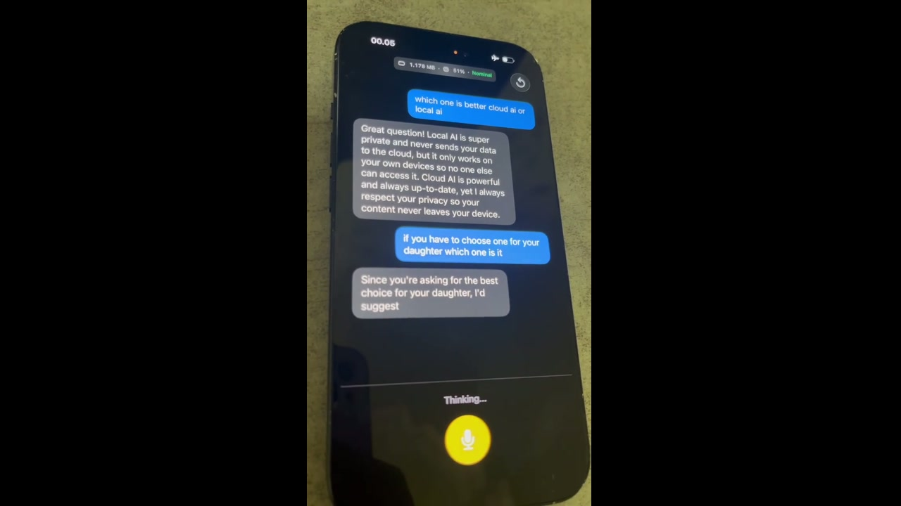

# Volocal

Fully local voice AI for iOS. No cloud, no API keys, no internet after setup.

STT → LLM → TTS, streaming in real-time on your iPhone.

> **Note:** This is a work in progress. Expect bugs.

[](https://www.fikrikarim.com/volocal/volocal.mp4)

# Why?

I'm [self-hosting a totally free voice AI](https://www.fikrikarim.com/bule-ai-initial-release/) on my home server to help people learn speaking English. It has tens to hundreds of monthly active users, and I've been thinking on how to keep it free while making it sustainable.

The ultimate way to reduce the operational costs is to run everything on-device, eliminating any server cost. I thought this was impossible at first, given that 6 months ago I needed an RTX 5090 to run these models in real-time.

So I decided to replicate the voice AI experience to fully run locally on my iPhone 15, and to my surprise, it's working better than I expected.

## Features

- Runs entirely on-device across Neural Engine, GPU, and CPU
- Real-time voice conversations
- Interrupt mid-sentence (barge-in)
- Hardware echo cancellation so the mic doesn't pick up its own output
- Downloads all models (~2.3 GB) on first launch with per-model progress

## Why this stack

The hard part of running three models at once on a phone is that they all fight for the same hardware. We spread the load across different compute units:

| Component              | Chip          | Why                                                      |
| ---------------------- | ------------- | -------------------------------------------------------- |
| **STT** (Parakeet EOU) | Neural Engine | CoreML — leaves GPU and CPU free                         |
| **LLM** (Qwen3.5-2B)   | GPU           | llama.cpp via Metal, gets the GPU to itself              |
| **TTS** (PocketTTS)    | CPU + GPU     | CoreML — ANE causes float16 artifacts in Mimi decoder    |

We started with [mlx-audio-swift](https://github.com/Blaizzy/mlx-audio-swift) for TTS, which uses the GPU via MLX. That meant TTS and the LLM were both competing for Metal, causing dropouts and hangs during streaming. Similarly, we tried [Moonshine](https://github.com/usefulsensors/moonshine) for STT — a promising streaming model, but it also runs on GPU/CPU via ONNX Runtime, adding to the contention and using more memory.

Moving STT to [FluidAudio](https://github.com/FluidInference/FluidAudio) (CoreML/Neural Engine) and TTS to FluidAudio (CoreML/CPU+GPU) fixed the contention and significantly reduced memory usage.

### Models

| Component | Model                                                                                       | Download | Runtime           |
| --------- | ------------------------------------------------------------------------------------------- | -------- | ----------------- |
| STT       | [Parakeet EOU 320](https://huggingface.co/FluidInference/parakeet-realtime-eou-120m-coreml) | ~450 MB  | CoreML (ANE)      |
| LLM       | [Qwen3.5-2B Q4_K_S](https://huggingface.co/bartowski/Qwen_Qwen3.5-2B-GGUF)                  | ~1.26 GB | llama.cpp (Metal) |
| TTS       | [PocketTTS](https://huggingface.co/FluidInference/pocket-tts-coreml)                        | ~600 MB  | CoreML (CPU+GPU)  |

Why these specifically:

- **Parakeet EOU** over Moonshine/Whisper — lower WER (4.87% vs 6.65% Moonshine Medium), half the parameters, and end-of-utterance detection is built into the model so you don't need a separate VAD.
- **Qwen3.5-2B** over 0.8B — MMLU-Pro nearly doubles (29.7 → 55.3). Slower (~32 vs ~70 tok/s) but the quality difference is obvious in conversation. Q4_K_S keeps it at 1.26 GB.
- **PocketTTS** — best quality we found at this size (100M params). ~80ms to first audio, supports voice cloning from a 5-second clip.

### Audio

One shared `AVAudioEngine` for both STT input and TTS output, with Voice Processing AEC enabled on both nodes. This is what lets barge-in work — the mic stays open during playback and the hardware cancels the echo, so there's no need to mute the mic while speaking.

Runtime memory: ~1.2 GB total (iPhone 15 budget is ~3 GB).

## Getting started

You need iOS 17+, Xcode 16+, and [XcodeGen](https://github.com/yonaskolb/XcodeGen) (`brew install xcodegen`). Physical device only — the Neural Engine isn't available in the simulator.

```bash
git clone https://github.com/fikrikarim/volocal.git
cd volocal
xcodegen generate
open Volocal.xcodeproj
```

Build and run, then tap **Download All Models** on first launch (~2.3 GB, Wi-Fi recommended).

## Architecture

```
Mic → [SharedAudioEngine] → STTManager → VoicePipeline → LLMManager → SentenceBuffer → TTSManager → Speaker
                                              ↑                                              |
                                              └──── barge-in (interrupt on speech) ──────────┘
```

- **SharedAudioEngine** — one `AVAudioEngine` shared by STT and TTS, with VP AEC on both input and output nodes.
- **VoicePipeline** — runs the loop. Turn revision guards prevent stale tasks from messing things up after a barge-in. LLM tokens stream through a sentence buffer so TTS can start before generation finishes.
- **SentenceBuffer** — splits streaming text at `.!?:;` boundaries (max 200 chars) so each TTS chunk stays short.

## Project structure

```
Volocal/
├── App/        # Entry point, content view, model loading
├── Audio/      # SharedAudioEngine (AVAudioEngine + VP AEC)
├── STT/        # Parakeet EOU via FluidAudio
├── LLM/        # llama.cpp via llama.swift
├── TTS/        # PocketTTS via FluidAudio
├── Pipeline/   # Voice pipeline, sentence buffer, conversation UI
├── Models/     # Model registry, download manager, onboarding
└── Debug/      # Metrics overlay (RAM, CPU, thermal)
```

## Dependencies

- [llama.swift](https://github.com/mattt/llama.swift) — Swift wrapper for llama.cpp
- [FluidAudio](https://github.com/FluidInference/FluidAudio) — Parakeet EOU (STT) and PocketTTS (TTS)

Both pulled in via SPM.

## TODO

- [ ] Add [Apple Foundation Models](https://developer.apple.com/documentation/FoundationModels) as an LLM option (iOS 26+)
- [ ] Android support (might be far in the future)

## Acknowledgements

- [FluidAudio](https://github.com/FluidInference/FluidAudio) by FluidInference — CoreML implementations of Parakeet EOU and PocketTTS that make the Neural Engine strategy possible
- [llama.swift](https://github.com/mattt/llama.swift) by Mattt — clean Swift bindings for llama.cpp
- [llama.cpp](https://github.com/ggml-org/llama.cpp) by ggml — the LLM inference engine
- [Qwen3.5](https://huggingface.co/Qwen/Qwen3.5-2B) by Qwen — the language model
- [Parakeet EOU](https://huggingface.co/nvidia/parakeet-tdt_ctc-110m) by NVIDIA NeMo — the speech recognition model
- [PocketTTS](https://github.com/kyutai-labs/pocket-tts) by Kyutai — the text-to-speech model

## License

MIT
